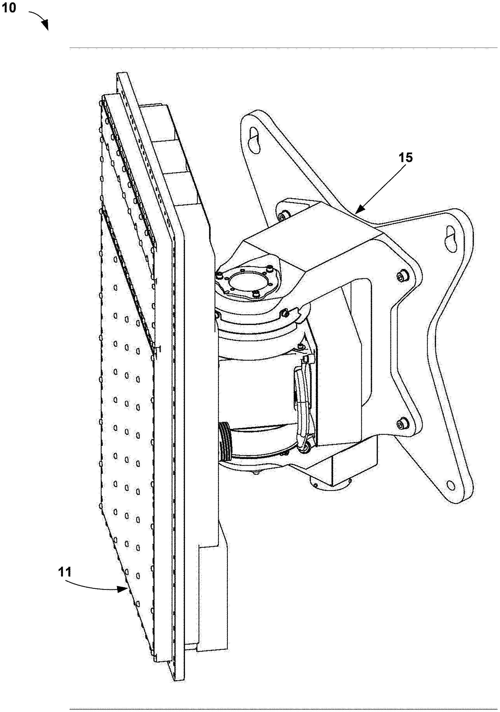

# Better Kartoffel Radar



This is a helper crate for easier production of...
🥔 [kartoffels](https://github.com/patryk27/kartoffels) 🥔
A little potato based survival horror 

## Goals

After looking at the radar for the kartoffels I decided I wanted something that operated a little better

The main functionality of the crate is around the problem of knowing which radar scan to look at.
The `Radar` struct tracks which scans have occured most recently, and then when you call `.at` it will return the most up to date information and when that radar scan happened, this means you can mix and match scan sizes across threads and read the most up-to date scan info
it also offers an estimation as to when you are next able to scan

## Usage

This wraps most of the radar functionality, and stores some internal state stuff, this means you should avoid using the in-build `kartoffel` radar functionality such as `radar_scan_3x3`

```rs
use better_kartoffel_radar::Radar;

let radar = Radar::new();

radar.wait();
let _ = radar.scan(3); // if I don't use 'radar.wait()' then I might need to check the result (the same for if I'm not hard coding using 3 here)

let (front,scanned_time) = radar.at(0,-1);
// since this '.at' was the next command we don't really care about scanned_time, but if we were somewhere else then this information might matter

// Somewhere much later in the code...
if radar.time_to_next_scan > 20_000 {
	// do something here since we have a while till we can next scan
} else {
	// maybe we just wait here because there's not long till the next available scan, and we might want to update our radar information
}

```

## Notes for future work

Currently this doesn't handel the bot id functionality for the radar
this should be added quite soon 

I'll also get around to actually writing those tests! 

## Contributing

Hey you, yes, you!
Feel free to contribute as much as you please, that'd be really cool!


